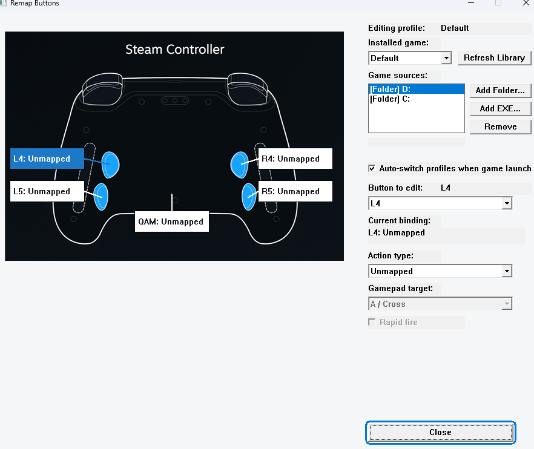
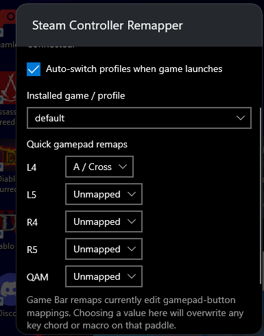
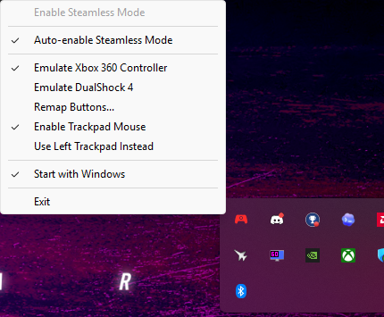

# Steam Controller Remapper

Steam Controller Remapper is a Windows tray app for using a **Steam Controller** without Steam Input taking over. It disables lizard mode, exposes the controller as a virtual Xbox 360 pad through [ViGEmBus](https://github.com/nefarius/ViGEmBus), and layers game-aware paddle profiles on top.

It now has two editing surfaces:

- a full desktop remapper for profile setup, sources, macros, and controller-first editing
- an Xbox Game Bar widget for in-session profile switching and quick paddle remaps

## At a glance

### Desktop remapper



The desktop editor is the full configuration surface. Use it to:

- build and edit per-game profiles
- add multiple game library folders or direct game `.exe` sources
- refresh and cache the installed-game list
- create gamepad, shortcut, macro, or unbound paddle actions
- enable rapid fire where it applies
- use controller navigation instead of relying on mouse-only interaction

### Xbox Game Bar widget



The widget is the quick-access surface for Xbox Mode and in-game use. Use it to:

- see the active profile and detected game
- toggle auto-switch
- switch to another installed-game profile
- make fast gamepad-button remaps for `L4`, `L5`, `R4`, `R5`, and `QAM`

Current widget limitation:

- Game Bar quick remaps currently edit only gamepad-button mappings. Choosing a value there will overwrite any key chord or macro on that paddle.

### Tray icon and quick controls



The tray icon is the quickest way to manage the remapper without opening the full editor. From the menu you can:

- toggle Steamless Mode and auto-enable behavior
- switch controller emulation mode
- open `Remap Buttons...`
- toggle trackpad mouse behavior
- toggle `Start with Windows`
- exit the app cleanly

## Feature set

- Runs the Steam Controller as a virtual Xbox 360 controller through ViGEm
- Automatically backs off when Steam is running so Steam Input can take over
- Auto-switches profiles when a matching game launches, then returns to `Default` when that game closes
- Supports Steam libraries, Xbox/Game Pass installs, broad game folders, and direct `.exe` sources
- Persists profiles, library sources, and widget state between launches
- Includes an Xbox Game Bar widget for live profile switching and quick remaps
- Includes controller-friendly navigation in the desktop remapper and input capture dialogs
- Starts from the tray and is safe to leave running

## Install

### Recommended release install

1. Download the latest release.
2. Install [ViGEmBus](https://github.com/nefarius/ViGEmBus/releases/latest).
3. Extract `SteamControllerRemapper-Installer.zip`.
4. Run `Install-SteamControllerRemapper.cmd`.
5. Launch `Steam Controller Remapper`.
6. Open Xbox Game Bar with `Win + G` and add the `Steam Controller Remapper` widget from the widgets menu.

What that installer does:

- installs the desktop app into `Program Files`
- enables `Start with Windows` for the current user
- imports the widget certificate
- installs the Game Bar widget and dependencies
- creates a Start Menu shortcut
- bypasses PowerShell execution policy for the installer launch

### Desktop-only install

If you do not want the widget, you can run `Steam Controller Remapper.exe` by itself after installing ViGEmBus.

## Xbox Mode startup

For reliable Xbox Mode startup, Windows Startup Apps should be set to **System startup** for `Steam Controller Remapper`, not **Desktop startup**.

1. Open **Settings > Apps > Startup**.
2. Find `Steam Controller Remapper`.
3. Change its startup mode to **System startup**.

## Requirements

- Windows 10 or later, 64-bit
- [ViGEmBus](https://github.com/nefarius/ViGEmBus/releases/latest)
- Steam Controller
- Xbox Game Bar, if you want the widget

## Build

```powershell
git clone https://github.com/CommonMugger/Steam-Controller-Remapper.git
cd Steam-Controller-Remapper
cmake --preset release
cmake --build --preset release
```

Release output:

- `build\release\Release\Steam Controller Remapper.exe`

To rebuild the Game Bar sideload bundle after the widget package exists:

```powershell
powershell.exe -ExecutionPolicy Bypass -File .\gamebar\SteamControllerRemapperWidget\BundleArtifacts\Build-SideloadBundle.ps1
```

## Credits

- Original project: [ddeverill/SteamlessController](https://github.com/ddeverill/SteamlessController)
- Original author: [ddeverill](https://github.com/ddeverill)
